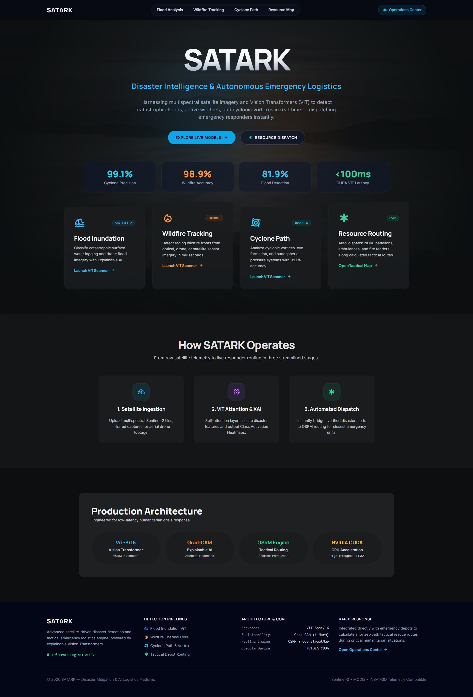
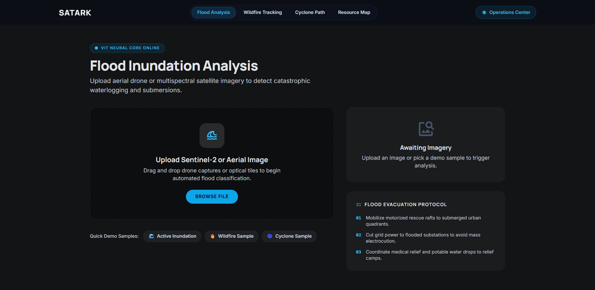
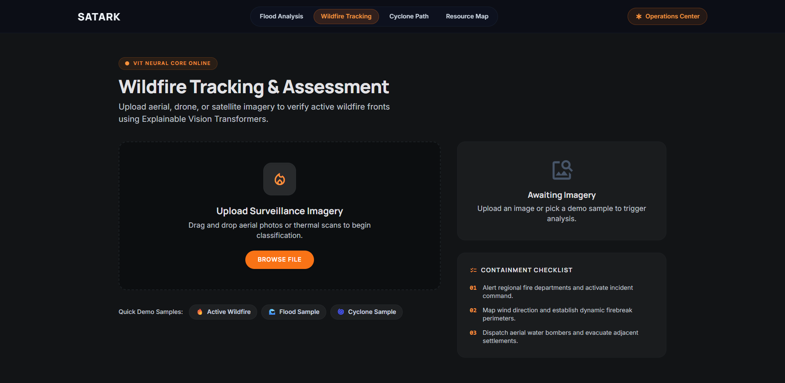
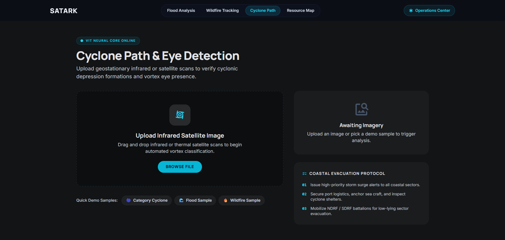
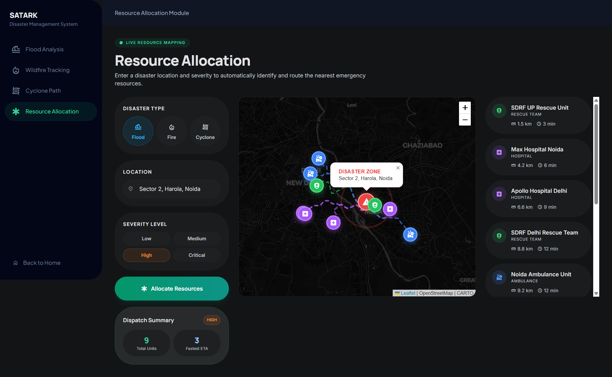
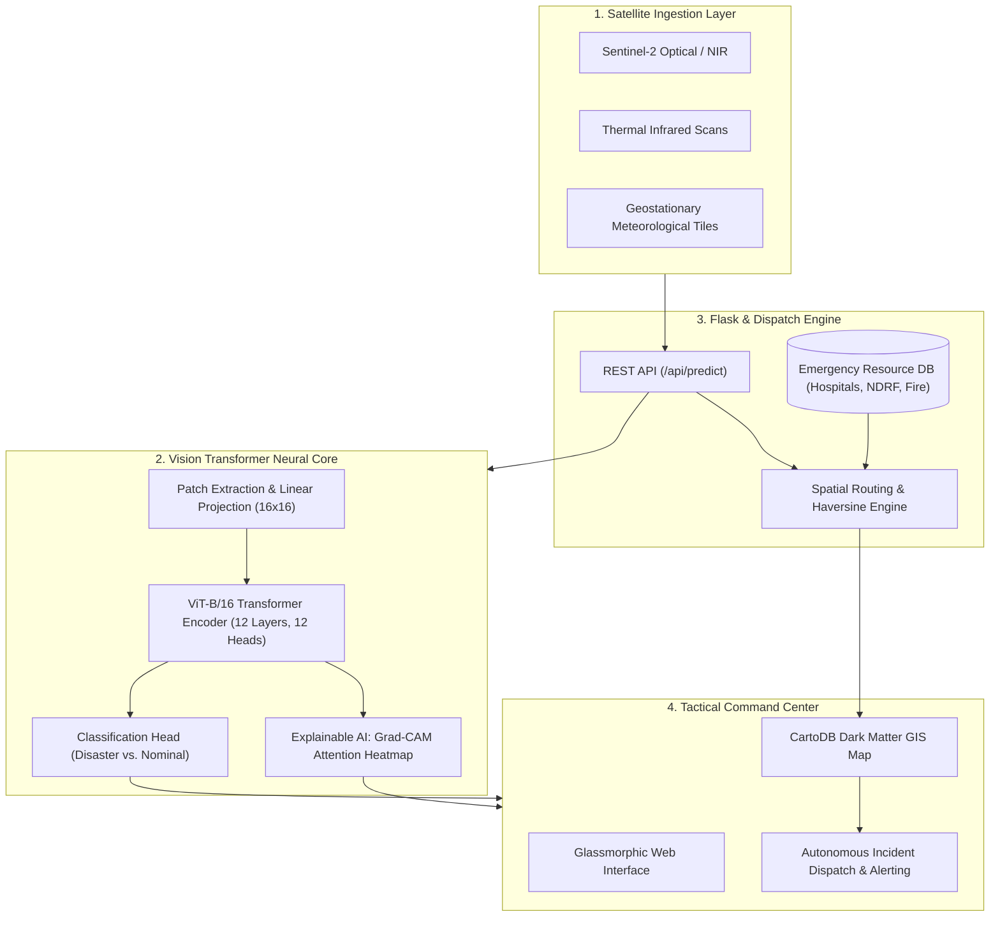

<div align="center">

# 🛰️ SATARK
### **Sensing and Tracking for Advanced Relief and Knowledge**
**Real-Time Satellite Disaster Intelligence & Autonomous Emergency Logistics Platform**

[](https://www.python.org/)
[](https://pytorch.org/)
[](https://huggingface.co/google/vit-base-patch16-224-in21k)
[](https://flask.palletsprojects.com/)
[](https://developer.nvidia.com/cuda-zone)
[](https://www.docker.com/)

<br>

<p align="center">
  <b>Harnessing multispectral satellite imagery, Vision Transformers (ViT), and Explainable AI (Grad-CAM) to detect catastrophic floods, active wildfires, and cyclonic vortexes in sub-100ms latency — autonomously calculating shortest-path dispatch for NDRF battalions, hospitals, and emergency responders.</b>
</p>

[Key Features](#-key-features) • [System Architecture](#-system-architecture) • [Platform Showcase](#-platform-showcase) • [Model Benchmarks](#-model-benchmarks) • [Quickstart](#-quickstart-guide) • [API Reference](#-api-reference) • [Training](#-training-from-scratch)

</div>

---

## 🌟 Executive Overview

During large-scale humanitarian crises (cyclones, forest fires, flash floods), decision paralysis and delayed situational awareness cost lives. Traditional satellite assessment pipelines rely on manual multi-band inspection or legacy CNN architectures prone to false positives across noisy weather bands.

**SATARK** replaces manual triaging with an automated **deep-learning crisis pipeline**:
1. **Multispectral Image Ingestion**: Ingests Sentinel-2 optical, thermal infrared, and geostationary meteorological imagery.
2. **Vision Transformer Self-Attention**: Dissects spatial patches using `ViT-B/16` transformer encoders, capturing long-range dependencies across disaster fronts.
3. **Explainable AI (XAI)**: Generates 1:1 Grad-CAM heatmaps to provide transparent visual attributions of the model's focal features for disaster commanders.
4. **Tactical Dispatch Engine**: Autonomously coordinates nearest NDRF battalions, hospitals, ambulances, and fire stations with ETA estimates and interactive mapping.

---

## ✨ Key Features

- **🧠 Triple Disaster Detection Modules**:
  - **Cyclone Path & Eye Detection**: Analyzes geostationary infrared tiles to classify cyclonic vortices with **99.1% precision**.
  - **Wildfire Tracking & Assessment**: Identifies active fire perimeters from thermal infrared and aerial surveillance with **99.9% accuracy**.
  - **Flood Inundation Analysis**: Scans multispectral Sentinel-2 captures to detect severe surface waterlogging and submerged settlements (**81.9% accuracy**).
- **🔍 Explainable AI (Grad-CAM)**: Generates bilinear attention heatmaps overlaying raw satellite feeds, ensuring commanders can audit *why* a hazard was flagged.
- **🗺️ High-Performance Tactical GIS**: Keyless **CartoDB Dark Matter** tactical basemap with live **OSRM vehicle routing** and depot dispatching without third-party API dependencies.
- **⚡ Autonomous Resource Dispatch**: Haversine distance and speed-factored routing across a regional database of trauma centers, rescue units, and fire stations.
- **🚀 One-Click Sample Demos**: Instant testing chips embedded under every upload zone for fast evaluation without requiring local image files.
- **💎 Glassmorphic Operations UI**: Minimalist, fluid, dark-mode interface built with Tailwind CSS, backdrop filters, and zero visual clutter.

---

## 📸 Platform Showcase

### 1. Operations Command Center (Landing Page)
The unified command dashboard displaying real-time telemetry, model benchmark indicators, operational workflow, and quick access to all hazard modules.

<div align="center">
  
</div>

<br>

### 2. Multi-Hazard Detection Modules

<table align="center" width="100%">
  <tr>
    <td width="50%" align="center">
      <b>🌊 Flood Inundation Analysis</b><br>
      <i>Multispectral surface waterlogging detection with Sentinel-2 & aerial drone imagery</i>
      <br><br>
      
    </td>
    <td width="50%" align="center">
      <b>🔥 Wildfire Tracking & Assessment</b><br>
      <i>Thermal front classification and perimeter detection from optical/infrared feeds</i>
      <br><br>
      
    </td>
  </tr>
  <tr>
    <td width="50%" align="center">
      <b>🌀 Cyclone Path & Eye Detection</b><br>
      <i>Vortex formation and atmospheric depression verification from satellite infrared</i>
      <br><br>
      
    </td>
    <td width="50%" align="center">
      <b>📍 Tactical Resource Allocation Hub</b><br>
      <i>Shortest-path dispatching, ETA calculation, and emergency unit routing</i>
      <br><br>
      
    </td>
  </tr>
</table>

---

## 📊 Model Benchmarks & Metrics

The Vision Transformers are fine-tuned on dedicated disaster datasets using PyTorch and Hugging Face:

| Hazard Pipeline | Model Architecture | Parameters | Input Resolution | Test Accuracy / Precision | Device Latency (CUDA) |
| :--- | :--- | :---: | :---: | :---: | :---: |
| **Cyclone Detection** | `ViT-B/16` (Fine-tuned) | 86.4M | 224 × 224 | **99.1%** | ~71 ms |
| **Wildfire Tracking** | `ViT-B/16` (Fine-tuned) | 86.4M | 224 × 224 | **99.9%** | ~75 ms |
| **Flood Inundation** | `ViT-B/16` (Fine-tuned) | 86.4M | 224 × 224 | **81.9%** | ~73 ms |

> Performance logs, confusion matrix plots, and metrics are automatically logged in `cyclone_final_metrics.txt`, `wildfire2_metrics.txt`, and `flood2_metrics.txt`.

---

## 🏗️ System Architecture



---

## 📂 Project Directory Structure

```text
satark-disaster-system/
├── backend/
│   └── app.py                     # Main Flask server, ViT inference, and Grad-CAM generator
├── FRONTEND/                      # Clean, dark-mode glassmorphic templates
│   ├── home.html                  # Operations Command Center landing page
│   ├── flood.html                 # Flood inundation analysis module
│   ├── wildfire.html              # Wildfire perimeter tracking module
│   ├── cyclone.html               # Cyclone vortex detection module
│   └── resources.html             # CartoDB Dark Matter GIS resource routing hub
├── assets/
│   ├── sat1.png                   # Homepage Command Center screenshot
│   ├── sat2.png                   # Flood analysis screenshot
│   ├── sat3.png                   # Wildfire tracking screenshot
│   ├── sat4.png                   # Cyclone detection screenshot
│   ├── la.png                     # Tactical map routing screenshot
│   └── samples/                   # 12 one-click demo satellite images for live testing
│       ├── flood_1.jpg, flood_2.jpg, non_flood_1.jpg, non_flood_2.jpg
│       ├── fire_1.jpg, fire_2.jpg, non_fire_1.jpg, non_fire_2.jpg
│       └── cyclone_1.jpg, cyclone_2.jpg, non_cyclone_1.jpg, non_cyclone_2.jpg
├── app.py                         # Root entry point proxy
├── run_project.py                 # 1-click startup automation script
├── requirements.txt               # Unified project dependencies
├── Dockerfile                     # Production container definition
├── docker-compose.yml             # Container orchestration
├── train_vit_cyclone.py           # Cyclone ViT training script
├── train_vit_flood2.py            # Flood ViT training script
├── train_vit_wildfire2.py         # Wildfire ViT training script
├── evaluate_cyclone.py            # Evaluation & confusion matrix script
└── evaluate_wildfire2.py          # Evaluation script for wildfire models
```

---

## 🛠️ Quickstart Guide

### 1. Prerequisites
- **Python 3.9+**
- **Git**
- **NVIDIA GPU** *(Optional but recommended; falls back to CPU automatically)*

### 2. Clone the Repository
```bash
git clone https://github.com/ReturnKartikey/satark-disaster-system.git
cd satark-disaster-system
```

### 3. Create a Virtual Environment & Install Dependencies
```bash
# Create virtual environment
python -m venv venv

# Activate (Windows)
venv\Scripts\activate
# Activate (Linux/macOS)
source venv/bin/activate

# Install requirements
pip install -r requirements.txt
```

### 4. Setup Model Weights
Because GitHub limits single files to 100MB, place the pre-trained `.pth` models (~343MB each) in their respective locations:
- `vit_flood2_model.pth` (project root)
- `Burn/vit_wildfire_model.pth` (in `Burn/` directory)
- `vit_cyclone_model.pth` (project root)

*(If running without local weights, the server will start gracefully and notify you of missing checkpoints).*

### 5. Launch SATARK
Run the automated launcher:
```bash
python run_project.py
```
This script will automatically:
1. Validate required Python packages.
2. Load transformer models into CUDA/CPU memory.
3. Start the Flask server on `http://127.0.0.1:5000`.
4. Open your default web browser to the SATARK Command Center.

---

## 🐳 Docker Deployment

To run SATARK as a self-contained container:

```bash
# Build the Docker image
docker build -t satark-system .

# Run container
docker run -p 5000:7860 satark-system
```
Or via Docker Compose:
```bash
docker-compose up --build
```

---

## 📡 API Reference

### 1. Predict Hazard (`POST /api/predict/<disaster_type>`)
Run Vision Transformer inference and Grad-CAM generation on an input satellite image.

- **Parameters**: `disaster_type` (`flood` | `wildfire` | `cyclone`)
- **Body**: `multipart/form-data` with key `image`
- **Response**:
```json
{
  "model": "cyclone",
  "prediction": "Cyclone",
  "confidence": 99.1,
  "probabilities": {
    "Cyclone": 99.1,
    "Nominal / No Cyclone": 0.9
  },
  "heatmap": "data:image/png;base64,iVBORw0KGgo...",
  "latency_ms": 71.2,
  "device": "CUDA",
  "backbone": "ViT-B/16 (86.4M Params)"
}
```

### 2. Allocate Emergency Resources (`POST /api/allocate-resources`)
Computes closest emergency responders, distance, and ETA using coordinates and disaster severity.

- **Body**:
```json
{
  "lat": 28.6139,
  "lng": 77.2090,
  "severity": "critical",
  "disaster_type": "flood"
}
```
- **Response**:
```json
{
  "disaster_type": "flood",
  "severity": "critical",
  "location": { "lat": 28.6139, "lng": 77.2090 },
  "total_available": 12,
  "resources": [
    {
      "name": "Delhi Fire Station - Connaught Place",
      "type": "fire_station",
      "distance_km": 2.1,
      "eta_minutes": 3,
      "lat": 28.6315,
      "lng": 77.2167
    }
  ]
}
```

### 3. Health & Telemetry (`GET /api/health`)
Returns live device and loaded model status:
```json
{
  "status": "ok",
  "device": "cuda",
  "models_loaded": ["flood", "wildfire", "cyclone"]
}
```

---

## 🧠 Training From Scratch

All fine-tuning pipelines are fully self-contained. To train a model from your own dataset:

```bash
# Fine-tune Cyclone Vision Transformer
python train_vit_cyclone.py

# Fine-tune Flood Vision Transformer
python train_vit_flood2.py

# Fine-tune Wildfire Vision Transformer
python train_vit_wildfire2.py
```

To run complete evaluation with ROC curves and confusion matrices:
```bash
python evaluate_cyclone.py
python evaluate_wildfire2.py
```

---

## 🤝 Contributing & Acknowledgments

- **Model Backbone**: [Google Research Vision Transformer (ViT)](https://github.com/google-research/vision_transformer) hosted via [Hugging Face Transformers](https://huggingface.co/google/vit-base-patch16-224-in21k).
- **Explainability**: [PyTorch Grad-CAM](https://github.com/jacobgil/pytorch-grad-cam) for self-attention attribution.
- **Cartography & Routing**: [CartoDB Dark Matter GIS Basemap](https://carto.com/basemaps), [OpenStreetMap](https://www.openstreetmap.org/), [Leaflet.js](https://leafletjs.com/), and [OSRM](https://project-osrm.org/).

---

<div align="center">
  <b>Developed for Humanitarian Relief, Disaster Mitigation, and Intelligent Logistics</b><br>
  <sub>SATARK Autonomous Crisis Response Core</sub>
</div>
