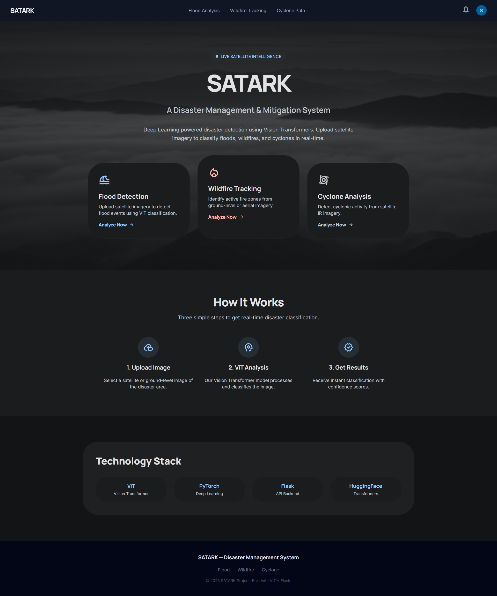
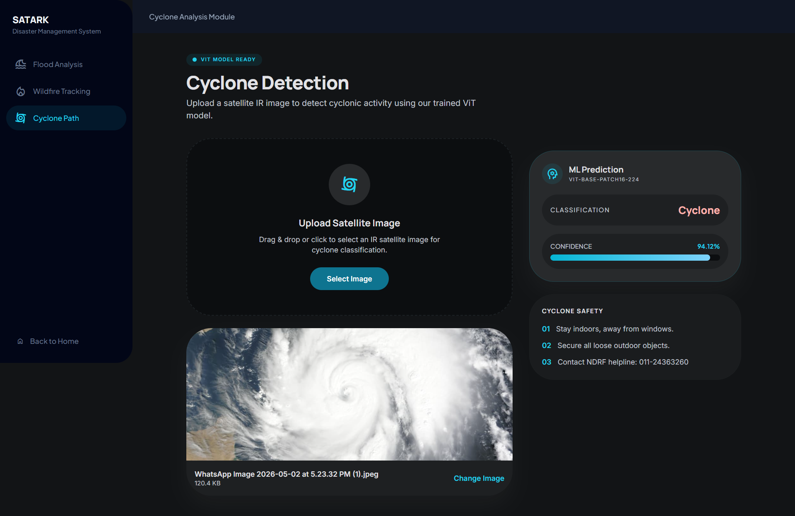
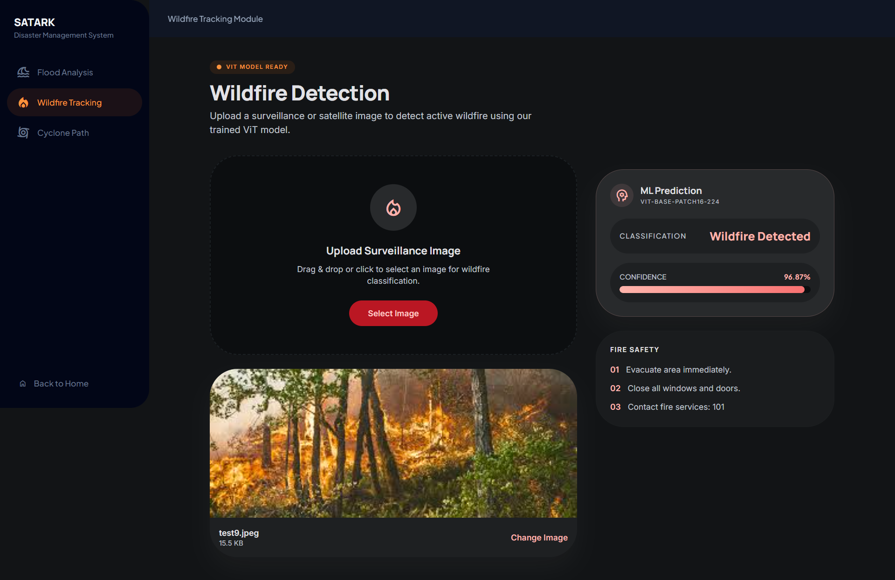
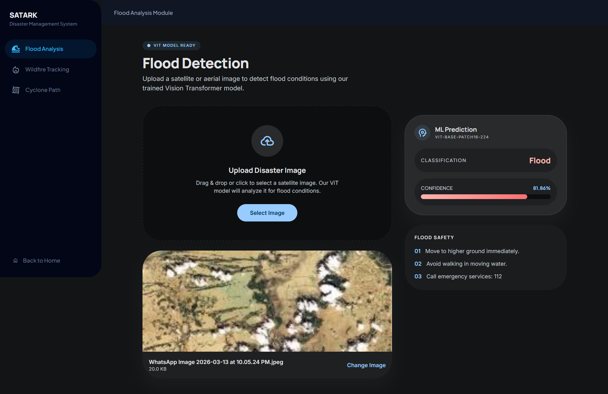

<div align="center">
  <h1>🌪️ SATARK: Disaster Management System</h1>
  <p><i>Sensing and Tracking for Advanced Relief and Knowledge</i></p>
  <p>An AI-powered web platform for real-time disaster classification (Flood, Cyclone, Wildfire) using Vision Transformers (ViT) and intelligent resource allocation.</p>
</div>

---

## 📖 About the Project

**SATARK** is designed to bridge the gap between disaster detection and emergency response. By analyzing satellite imagery using advanced Deep Learning models (Vision Transformers), it can accurately identify the presence of floods, cyclones, and wildfires. 

Furthermore, the system features a **Resource Allocation Engine** that calculates the distance to nearby emergency responders (Hospitals, NDRF battalions, Fire Stations) using the Haversine formula, providing an estimated time of arrival (ETA) for critical relief.

### ✨ Key Features
- **🧠 ViT-Powered Classification**: Utilizes `google/vit-base-patch16-224-in21k` fine-tuned on disaster datasets for high-accuracy image classification.
- **📍 Smart Resource Allocation**: Calculates the nearest emergency resources based on geographic coordinates.
- **💻 Glassmorphism UI**: A highly interactive, modern, and responsive web interface built with vanilla HTML/CSS/JS.
- **⚙️ Flask API Backend**: A lightweight, fast, and robust backend handling model inference and routing.
- **📊 Evaluation Metrics**: Built-in scripts to generate Confusion Matrices and ROC curves.

---

## 📸 Project Screenshots

Here is a look at the SATARK platform in action:

**1. Main Dashboard**


**2. Cyclone Detection Interface**


**3. Location Analytics & Resource Mapping**


**4. Real-time Prediction Examples**
<p float="left">
  
  
</p>

---

## 📂 Project Structure

```text
satark-disaster-system/
├── backend/                  # Flask server and API endpoints
│   ├── app.py                # Main backend logic and model inference
│   └── requirements.txt      # Backend dependencies
├── FRONTEND/                 # UI Templates (HTML/CSS/JS)
│   ├── home.html             # Landing page
│   ├── flood.html            # Flood detection interface
│   ├── cyclone.html          # Cyclone detection interface
│   ├── wildfire.html         # Wildfire detection interface
│   └── resources.html        # Resource mapping dashboard
├── *.pth (Not in repo)       # Large model weights (see Setup)
├── run_project.py            # Automated startup script
├── requirements.txt          # Global project dependencies
├── train_vit_*.py            # Scripts to train the ViT models from scratch
└── evaluate_*.py             # Scripts for model evaluation/testing
```

---

## 🛠️ Getting Started (For Developers & Users)

To run this project locally, follow these precise steps.

### 1. Prerequisites
Ensure you have the following installed on your system:
- **Python 3.9+**
- **Git**

### 2. Clone the Repository
```bash
git clone https://github.com/ReturnKartikey/satark-disaster-system.git
cd satark-disaster-system
```

### 3. Install Dependencies
Install all required Python libraries (PyTorch, Flask, Transformers, etc.):
```bash
pip install -r requirements.txt
```

### 4. Setup Model Weights (Crucial Step)
Because GitHub has a 100MB file limit, the large Vision Transformer `.pth` models (~343MB each) are **not included** in this repository. 

To run the inference server, you must either **train the models yourself** (see section below) or obtain the pre-trained weights and place them in the **root directory**:
- `vit_flood2_model.pth`
- `vit_wildfire2_model.pth`
- `vit_cyclone_model.pth`

*(Note: If you are evaluating the project and do not have these files, the server will still start, but prediction endpoints will return an error stating the model is missing).*

### 5. Run the Application
We have provided an automated script to start the environment:
```bash
python run_project.py
```
**What this script does:**
1. Verifies all required dependencies are installed.
2. Locates `backend/app.py`.
3. Loads the `.pth` models into Memory/GPU.
4. Starts the Flask server on `http://127.0.0.1:5000`.
5. Automatically opens your default web browser to the SATARK dashboard.

---

## 🧠 Training Your Own Models

This repository includes the complete end-to-end pipeline, not just the inference UI! If you want to train the models from scratch or fine-tune them on your own dataset, you can use the provided training scripts:

- `train_vit_cyclone.py`
- `train_vit_flood2.py`
- `train_vit_floodnet.py`
- `train_vit_wildfire2.py`

**To train a model:**
1. Ensure your dataset is structured correctly (e.g., in folders like `train/Yes` and `train/No` depending on the script).
2. Run the script: `python train_vit_cyclone.py`
3. The script will fine-tune the `google/vit-base-patch16-224-in21k` model on your dataset and automatically output the `.pth` file needed for the web app!

---

## 🧪 Testing and Evaluation

If you wish to evaluate the models against a test dataset, you can use the provided evaluation scripts. 
*Example:*
```bash
python evaluate_cyclone.py
```
This will process the images in your local test directories and generate performance metrics (`cyclone_final_metrics.txt`) and visualization plots (e.g., Confusion Matrices).


---

## 🤝 Contributing
Contributions, issues, and feature requests are welcome! Feel free to check the issues page.

## 📝 License
This project is part of a Minor/Major academic project. All rights reserved by the original creators.
